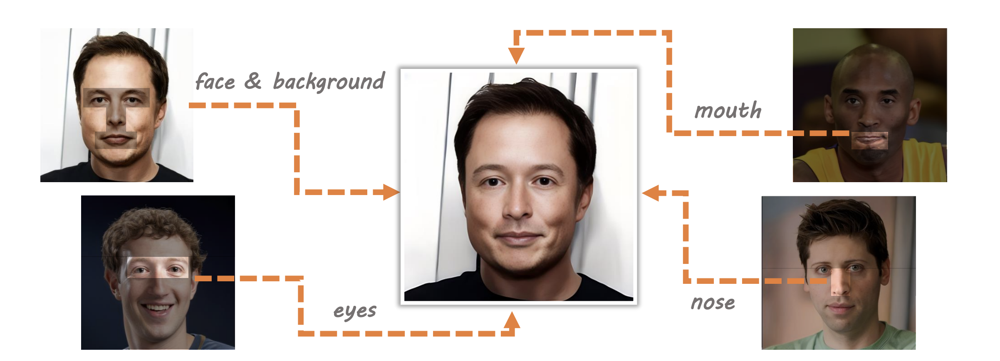
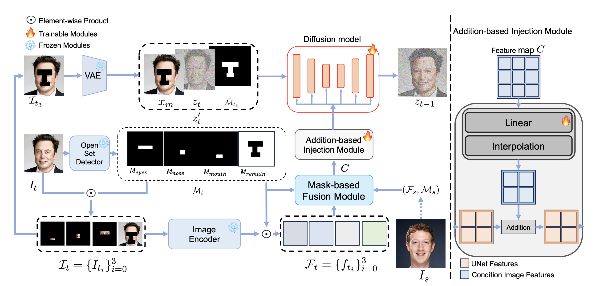
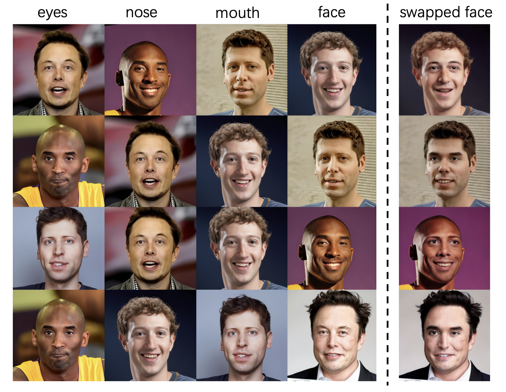

# [FuseAnyPart: Diffusion-Driven Facial Parts Swapping via Multiple Reference Images](https://arxiv.org/abs/2410.22771)

This is an official implementation for "FuseAnyPart: Diffusion-Driven Facial Parts Swapping via Multiple Reference Images"
## Introduction
We propose FuseAnyPart, a novel diffusion-driven method for facial parts
swapping. FuseAnyPart first extracts multiple decomposed features from face images with masks
obtained from an open-set detection model. Then parts from different faces are aggregated in latent
space with the Mask-based Fusion Module. An injection module injects this conditional information
into UNet for fusing effectively. Extensive experiments validate the superiority of FuseAnyPart.

## Getting Started

### installation
Our code is built on top of the `diffusers` library. To set up the environment and install the required dependencies, follow these steps:
```shell
git clone https://github.com/Thomas-wyh/FuseAnyPart.git
cd FuseAnyPart

pip install -r requirements.txt
```
### Inference
We provide a detailed python file [inference.py](inference.py) that demonstrates how to perform model inference. You can refer to this file to understand how to use the model and follow the inference process.

Before inference, it is necessary to prepare the weights for CLIP and Realistic_Vision_V4 in advance and organize them into the pretrained_weight directory as follows:

```plaintext
pretrained_weight
├── fap.bin
├── image_encoder
│   ├── config.json
│   └── model.safetensors
└── Realistic_Vision_V4.0_noVAE
    ├── model_index.json
    ......
```

### Trainning
We provide a script [train.sh](train.sh) that automates the model training process. The training images have been pre-processed with [GPEN](https://github.com/yangxy/GPEN) and [Grounding-DINO](https://github.com/IDEA-Research/GroundingDINO).

To start the training process, run the following command:
```shell
bash train.sh
```
## Results

## Citation
If you find FuseAnyPart useful for your research and applications, please cite using this BibTeX:
```
@inproceedings{yufuseanypart,
  title={FuseAnyPart: Diffusion-Driven Facial Parts Swapping via Multiple Reference Images},
  author={Yu, Zheng and Wang, Yaohua and Cui, Siying and Zhang, Aixi and Zheng, Wei-Long and Wang, Senzhang},
  booktitle={The Thirty-eighth Annual Conference on Neural Information Processing Systems}
}
```